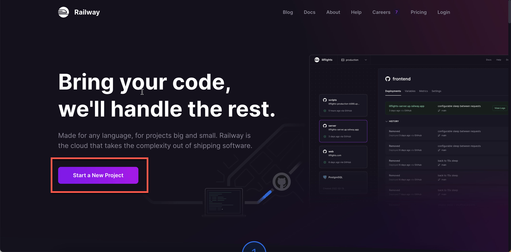
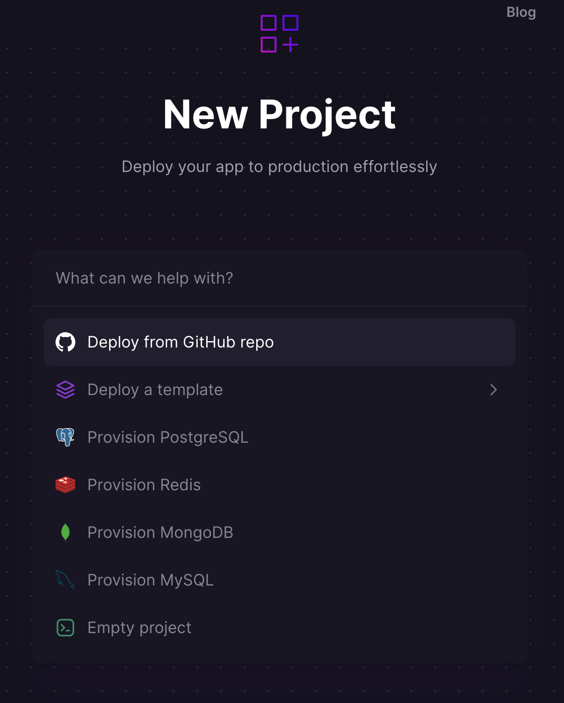
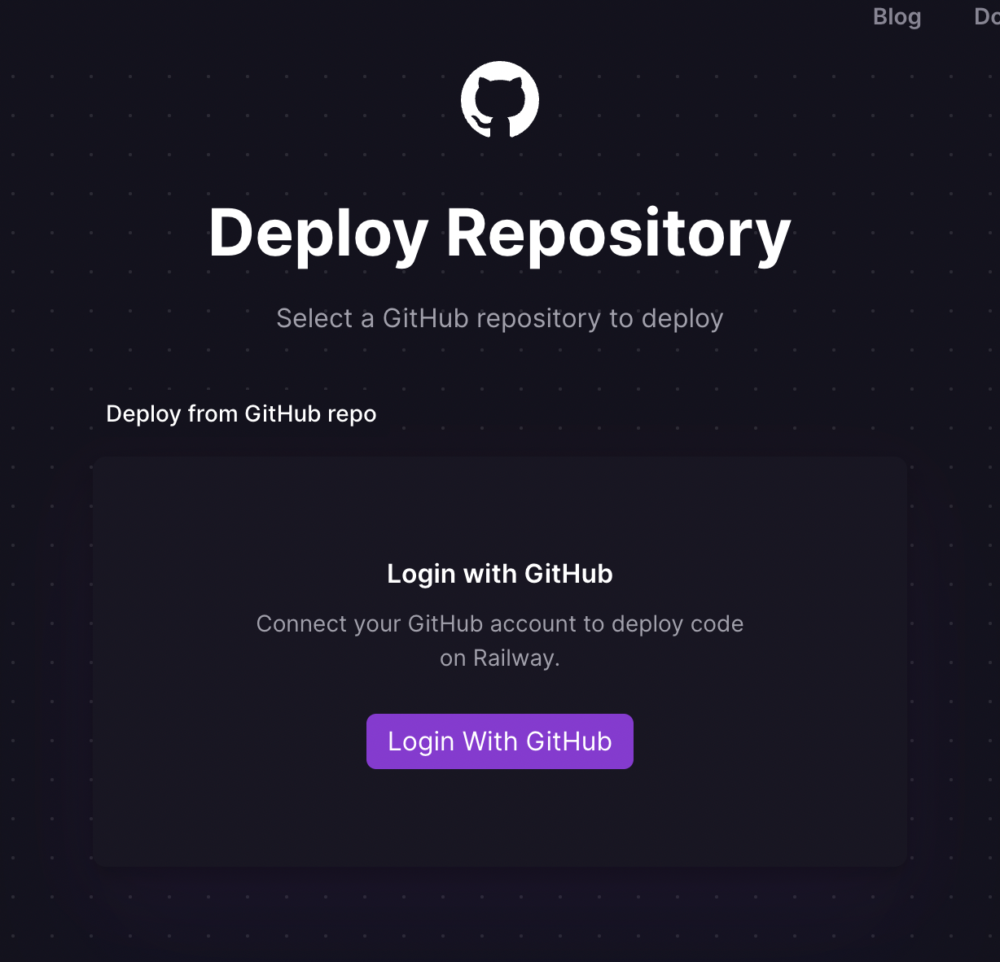
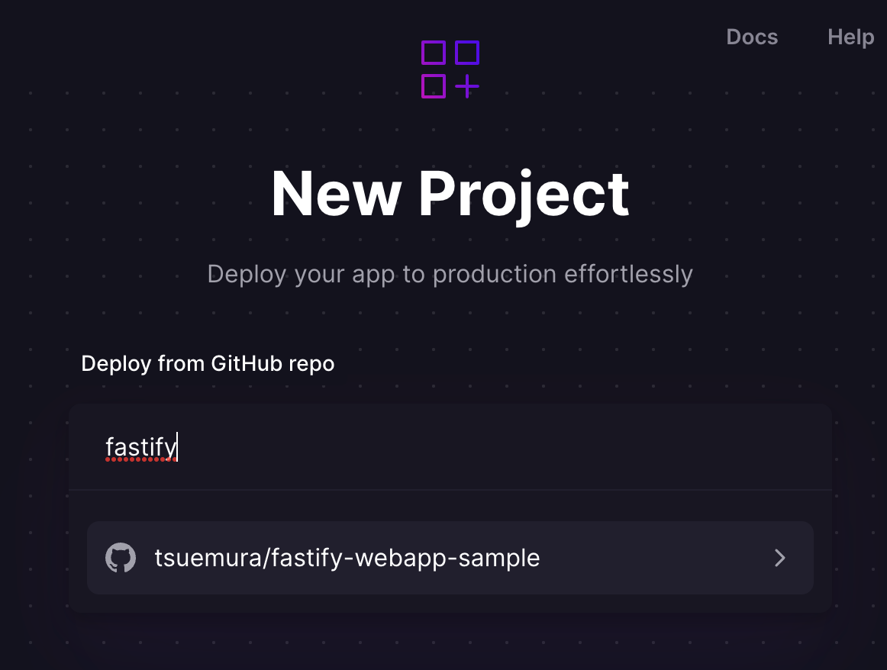

# Fastify-WebApp-Sample

[Fastify](https://www.fastify.io/) を使って作ったWebアプリケーションのサンプルです。
お弁当注文アプリを模して作られています。

## ローカル環境で起動する

### 事前準備

`NodeJS` およびパッケージマネージャーの `npm` が必要です。以下のコマンドでバージョンが表示されればインストールされています。インストールされていない場合は [公式サイト](https://nodejs.org/ja/) などからインストールが必要です。

```bash
# NodeJSがインストールされているかどうかを確認。
$ node --version
v20.14.0

# NodeJSのパッケージマネージャー npm がインストールされているかどうかを確認。通常はNodeJSが入っていればnpmも一緒に使えるようになるはずです。
$ npm --version
10.7.0
```

また、バックエンドのデータベースとして [PostgreSQL](https://www.postgresql.org/) を利用しています。これを起動するために [Docker](https://www.docker.com/) のインストールが必要です。詳しいインスール手順については公式の [Get Started](https://www.docker.com/get-started/) を参考にしてください。

```bash
# Docker がインストールされていることを確認。
$ docker --version
Docker version 20.10.11, build dea9396

# docker compose コマンドが利用できることを確認。Dockerをインストールすれば、通常 docker ccompose コマンドも一緒に利用できるようになります。
$ docker compose version
Docker Compose version v2.2.1

# Dockerが起動していることを確認。 hello-world というコンテナをダウンロードして実行する。
$ docker run hello-world
Unable to find image 'hello-world:latest' locally
latest: Pulling from library/hello-world
7050e35b49f5: Pull complete
Digest: sha256:aa0cc8055b82dc2509bed2e19b275c8f463506616377219d9642221ab53cf9fe
Status: Downloaded newer image for hello-world:latest

Hello from Docker!
This message shows that your installation appears to be working correctly.

To generate this message, Docker took the following steps:
 1. The Docker client contacted the Docker daemon.
 2. The Docker daemon pulled the "hello-world" image from the Docker Hub.
    (arm64v8)
 3. The Docker daemon created a new container from that image which runs the
    executable that produces the output you are currently reading.
 4. The Docker daemon streamed that output to the Docker client, which sent it
    to your terminal.

To try something more ambitious, you can run an Ubuntu container with:
 $ docker run -it ubuntu bash

Share images, automate workflows, and more with a free Docker ID:
 https://hub.docker.com/

For more examples and ideas, visit:
 https://docs.docker.com/get-started/

# hello-worldで、以下のようなメッセージが出た場合はDockerが起動されていません。
$ docker run hello-world
docker: Error response from daemon: dial unix docker.raw.sock: connect: connection refused.
See 'docker run --help'.

```

### 開発用サーバーの起動

最初に、開発に必要なパッケージを一通りインストールします。以下のコマンドでインストールできます。
```bash
$ npm install
```

次に、アプリの起動に必要な情報を生成します。 `env.example` というファイルにサンプルを用意してあるので、これをそのままコピーしてしまいましょう。

```bash
$ cp env.example env
```

次に、開発用サーバーを起動します。このときにデータベースなどのバックエンドも一緒に起動されます。
```bash
$ npm run dev

> fastify-react-sample@1.0.0 dev
> docker compose up -d && nodemon src/index.js

[+] Running 1/0
 ⠿ Container fastify-react-sample-db-1  Running       0.0s
[nodemon] 2.0.20
[nodemon] to restart at any time, enter `rs`
[nodemon] watching path(s): src/**/*
[nodemon] watching extensions: ts,mjs,ejs,js,json,graphql
[nodemon] starting `node src/index.js`

Server listening at http://0.0.0.0:8080
```

最後に、データベースのマイグレーションを行います。マイグレーションとは、データベースのテーブル作成などのセットアップ作業のことを指します。別のターミナルをもう一つ起動して、以下のコマンドを実行しましょう。

```bash
$ npm run db:migrate
```

これで準備完了です。先ほどのターミナルに出力されていた、 `http://0.0.0.0:8080` というページにアクセスしてみましょう。

## リモート環境にデプロイする

### 事前準備: fork または import

事前準備として、このリポジトリを fork する、または import する必要があります。いずれも、このリポジトリを、あなたのアカウントにコピーするための機能です。

- fork: このリポジトリとの関連を保ったまま、分岐した別のリポジトリとして管理する。Publicのみ。
- import: このリポジトリのコピーを作成する。Privateにもできる。

forkもimportも出来ることに大きな差は無いのですか、forkはこのリポジトリから分岐したものとして扱われ、importは全く別のコピーを作成する機能です。重要な違いとして、 import はコピーしたリポジトリを private 、つまり非公開に設定できるのに対し、 fork は public 、つまり公開設定にしか出来ません。特にあなたがGitの操作に慣れていない場合などは、リポジトリが public になっていることによって、誤ってパスワードやアクセストークンなどの重要な情報をインターネット上に公開してしまうかもしれません。初めて Git や GitHub を使う場合などは、 import を使って新たな private リポジトリを作ったほうが良いでしょう。

fork および import の詳細な方法は以下に記載されています。

Fork: https://docs.github.com/ja/get-started/quickstart/fork-a-repo
Import: https://docs.github.com/ja/get-started/importing-your-projects-to-github/importing-source-code-to-github/importing-a-repository-with-github-importer

### Railway にデプロイする

[Railway](https://railway.app/) はPostgreSQLなどのデータベースバックエンドを含むインフラストラクチャを簡単にデプロイするためのサービスです。2024年7月現在、最初に $5 の無料枠が付与され、以降は毎月 $5 の利用量 + メモリ・CPU・ネットワーク通信の費用が従量課金となります。

#### 新しいプロジェクトをセットアップする

サイトトップの "Start New Project" から、リポジトリの選択に進みます。










これで、新しいプロジェクトにWebアプリがデプロイされました。しかし、この時点ではまだ必要な情報が入っていませんし、データベースも作成されていませんので、ビルドはクラッシュしています。

#### データベースを設定する

続いてデータベースの設定に移ります。プロジェクトのトップページからPostgreSQLデータベースを作成します。


プロジェクトにWebアプリと PostgreSQL データベースがセットアップされました。


#### 環境変数を設定する

次に、アプリを動かすために必要な環境変数をセットアップしましょう。

##### session secret の設定

session secret と呼ばれるセッションの暗号化のためのキーを設定します。


ここには任意の値をセットしましょう。どこかからコピーしてきた値ではなく、必ず **あなた自身がランダムに生成したもの** を使ってください。ランダムな値は以下のようなコマンドで生成できます。

```bash
$ openssl rand -hex 32
```

##### データベースのアクセス情報

データベースへのアクセス設定を追加します。

- PGHOST
- PGDATABASE
- PGPASSWORD
- PGPORT
- PGUSER

値には Postgres サービスのものを設定します。 Railway のドキュメントを参考に設定してください。

https://docs.railway.app/guides/variables#autocomplete-dropdown

#### ドメインを設定する

最後に、アプリを確認するためのドメインを設定しましょう。Railwayはサブドメインを無料で用意してくれます。


準備が整ったら、ドメインにアクセスしてみましょう。このようなサイトが表示されたら完了です。


